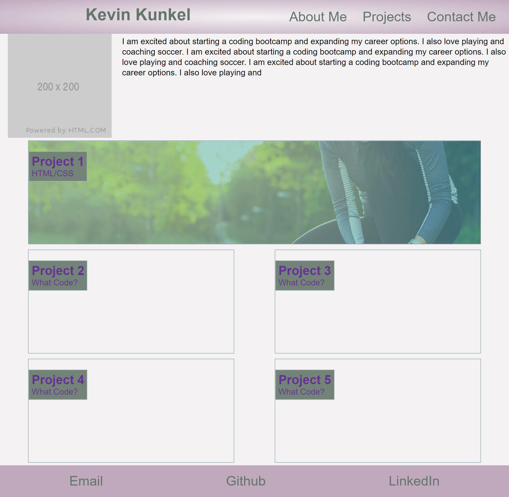
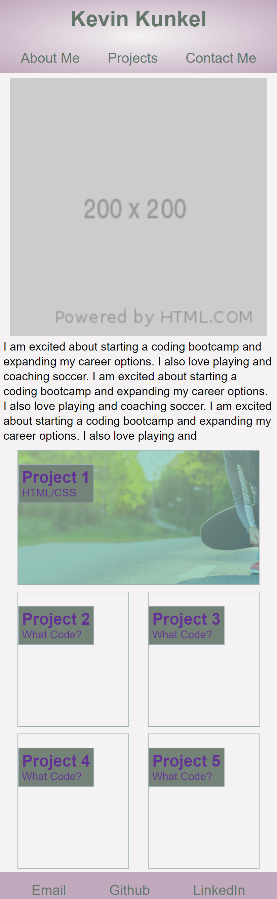

# Portfolio

Made a portfolio to be able to show all my work.  Still need to add a good headshot, but a placeholder image is in place.

The webpage is responsive and designed with a mobile first approach.  Nav links at the top direct you to different sections of the page.  The projects have links to the completed projects.  Only one project is present and templates are in place for 4 others.  The first project is is larger than the rest.  Psuedo elements are in place for hover states for any link.

The website is [https://kunkelkevin.github.io/Portfolio/](https://kunkelkevin.github.io/Portfolio/)

Screenshot for the page when viewed from a large screen (desktop):

Screenshot for the page when viewed from a small screen (mobile):

